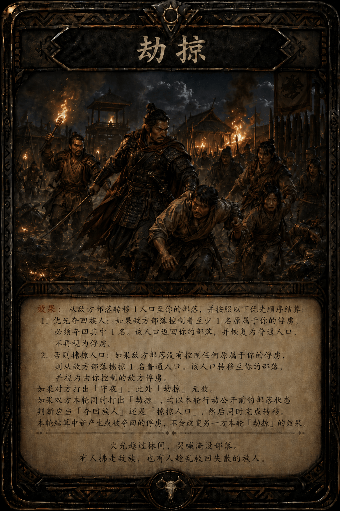
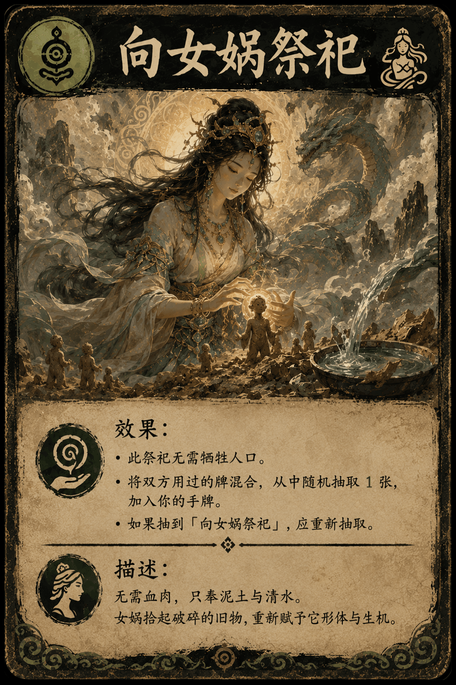
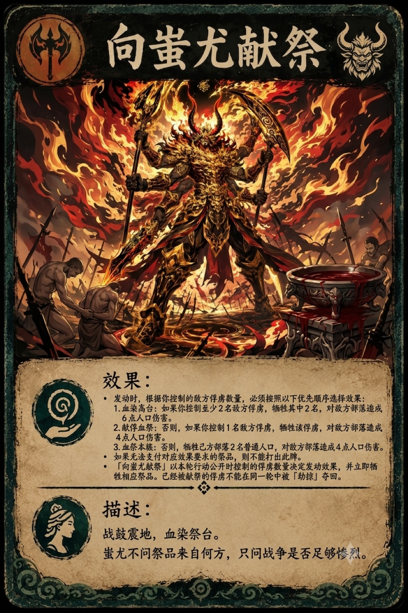

# 大祭司模拟器 v1.3

> 18 牌基础版、16 牌基础版、9 牌版。

## 16 牌基础版

* 双方各自拥有完全相同的 8 张卡牌：

  - 「劫掠」× 2

  - 「夜袭」× 2

  - 「守夜」× 2

  - 「向蚩尤献祭」× 1

  - 「向女娲祭祀」× 1

* 每个部落初始拥有 15 人口。
* 双方同时秘密选择本轮行动：有手牌时打出 1 张卡牌；仅在最后一轮时，没有手牌的玩家发动「垂死一搏」。使用后的牌进入各自的弃牌堆。
* 双方同时公开并结算本轮行动。当任一部落人口降至 0 或以下时，该部落被击败。

### 1 **人口**

每位玩家拥有一个独立且公开的部落人口数。

游戏开始时，每个部落拥有 **15 人口**。玩家使用人口标记、计数器或纸笔记录当前人口。

卡牌造成「人口伤害」时，受影响的部落减少相应人口；卡牌要求“牺牲人口”时，使用者必须先拥有足够的人口，才能发动该效果。

通过「劫掠」获得的人口加入控制者的部落人口，同时保留“敌方俘虏”的身份。俘虏可以作为普通人口承受损失，也可以用于需要敌方俘虏的献祭。

每名俘虏保留其原所属部落的信息。如果原所属部落通过「劫掠」将其夺回，该人口返回原所属部落，并恢复为普通人口，不再视为俘虏。

当部落失去人口时，由该部落的玩家决定优先失去普通人口还是俘虏，除非卡牌另有说明。

人口不能低于 0。当任一部落的人口降至 0 时，该部落立即被击败，对方玩家获胜。

如果双方部落的人口在同一次结算中同时降至 0，则本局为平局。

### 2 垂死一搏

回合开始时，按照以下顺序进行判定：

1. **如果双方均没有手牌**，则立即比较双方人口。人口较多的一方获胜；人口相同则为平局。
2. **如果只有一方没有手牌**，则本轮为最后一轮。没有手牌的玩家发动「垂死一搏」，仍有手牌的玩家正常打出一张卡牌。
3. **最后一轮结算完成后**，如果双方均未被击败，则比较双方剩余人口。人口较多的一方获胜；人口相同则为平局。
4. **如果双方均仍有手牌**，则正常进行本轮行动。

发动「垂死一搏」时，秘密选择投入 **1～3 人口**，且投入数量不能超过己方当前人口。双方选择完行动后，同时公开。

结算时，己方部落失去所投入的人口，并对敌方部落造成等量的人口伤害。

「垂死一搏」不视为卡牌，不会进入弃牌堆，也不能被「守夜」抵消。它与对方本轮打出的卡牌同时结算。

### 3 弃牌堆

每位玩家拥有一个独立且公开的弃牌堆。

卡牌使用后，进入其拥有者的弃牌堆。

玩家通过「向女娲祭祀」获得对方的卡牌时，只获得该牌的临时控制权。该牌使用后，仍进入其原拥有者的弃牌堆。

发动「向女娲祭祀」时，将双方弃牌堆中所有可抽取的牌临时混合，随机抽取一张。抽取完成后，其余卡牌放回各自拥有者的弃牌堆。

### 4 卡牌设计

#### 4.1 夜袭

**效果：**

如果本轮对方的卡牌不是「守夜」，对敌方部落造成 3 点人口伤害。

**描述：**

月黑风高，烽火未燃。

当敌方听见马蹄声时，长矛已然沾血。

#### 4.2 守夜

**效果：**

如果本轮对方打出「夜袭」或「劫掠」，使其效果无效。

如果对方打出的是「夜袭」，再对敌方部落造成 1 点人口伤害。

**描述：**

长夜无声，火把未熄。

龟甲上的纹路告诉你，今夜不同寻常。

于是你安排守夜人握紧兵刃，只等黑暗中的脚步靠近。

#### **4.3 劫掠**

**效果：**

从敌方部落转移 1 人口至你的部落，并按照以下优先顺序结算：

1. **优先夺回族人：** 如果敌方部落控制着至少 1 名原属于你的俘虏，必须夺回其中 1 名。该人口返回你的部落，并恢复为普通人口，不再视为俘虏。
2. **否则掳掠人口：** 如果敌方部落没有控制任何原属于你的俘虏，则从敌方部落掳掠 1 名普通人口。该人口转移至你的部落，并视为由你控制的敌方俘虏。

如果对方打出「守夜」，此次「劫掠」无效。

如果双方本轮同时打出「劫掠」，均以本轮行动公开前的部落状态判断应当「夺回族人」还是「掳掠人口」，然后同时完成转移。本轮结算中新产生或被夺回的俘虏，不会改变另一方本轮「劫掠」的效果。

**描述：**

火光越过林间，哭喊淹没部落。

有人掳走敌族，也有人趁乱救回失散的族人。

#### 4.4 向女娲祭祀

**效果：**

此祭祀无需牺牲人口。

在双方弃牌堆中合计至少有 3 张可抽取的牌的情况下，将双方用过的牌混合，从中随机抽取 1 张，加入你的手牌。

如果抽到「向女娲祭祀」，应重新抽取。

**描述：**

无需血肉，只奉泥土与清水。

女娲拾起破碎的旧物，重新赋予它形体与生机。

#### 4.5 向蚩尤献祭

**效果：**

发动时，根据你控制的敌方俘虏数量，必须按照以下优先顺序选择效果：

1. **血染高台：** 如果你控制至少 2 名敌方俘虏，牺牲其中 2 名，对敌方部落造成 6 点人口伤害。
2. **献俘血祭：** 否则，如果你控制 1 名敌方俘虏，牺牲该俘虏，对敌方部落造成 4 点人口伤害。
3. **血祭本族：** 否则，牺牲己方部落 2 名普通人口，对敌方部落造成 4 点人口伤害。

如果无法支付对应效果要求的祭品，则不能打出此牌。

**同轮结算：**

「向蚩尤献祭」以本轮行动公开时控制的俘虏数量决定发动效果，并立即牺牲相应祭品。已经被献祭的俘虏不能在同一轮中被「劫掠」夺回。

**描述：**

战鼓震地，血染祭台。

蚩尤不问祭品来自何方，只问战争是否足够惨烈。